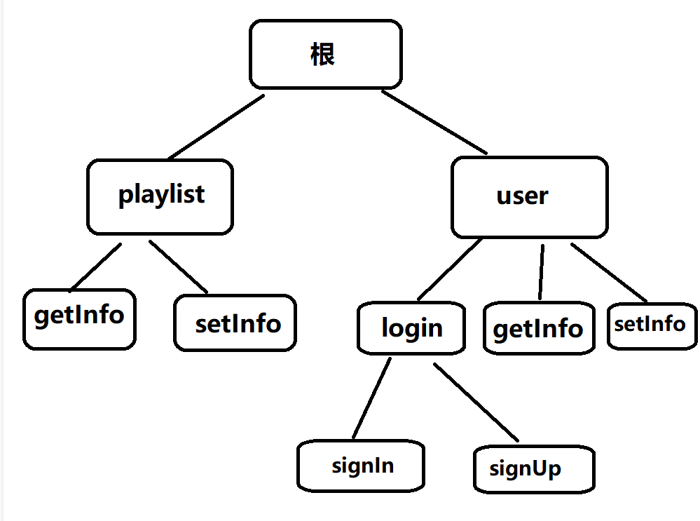
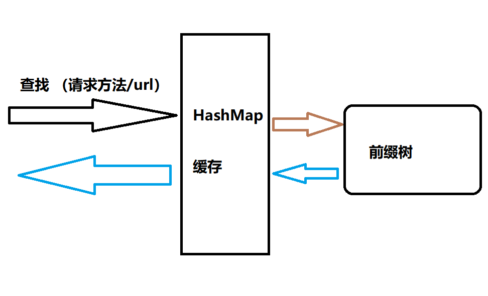

# [c++/HTTP] 路由的 前缀树和哈希表 实现

## 路由

- 路由指的其实就是 url 和 响应函数 之间的映射关系

- 在一个服务中，我们可以为多个url以及它的不同的请求方法（如Get、Post等）指定各自的响应函数，当用户向服务器发送某一url的某一请求方法时，执行我们绑定的响应函数。

- 例如：我的服务有：
    - Post /user/login -> User.login() 登录接口
    
    - Get /user/info -> User.getInfo() 获取用户信息接口
    
    - Post /user/info -> User.setInfo() 修改用户信息接口
    
    - ...

- 平时使用一些框架时，往往提供了很方便的操作来帮助我们为解决这些映射关系，下面我们就来聊聊如何自己实现一个路由。

## 基础功能

- 首先我们先理清楚基本的路由需要实现哪些功能：
    - 根据url和方法，来调用对应绑定的函数。
    
    - 如果请求的url没有绑定任何函数，则应当返回404，即**请求位置不存在**
    
    - 如果请求的url有绑定函数，但该请求的方法却没有绑定函数，则应当返回403，即**请求方法不正确**。例如：
        - 存在绑定 Post /user/login -> User.login()
        
        - 收到了一个请求 Get /user/login
        
        - /user/login 位置是存在绑定函数的，但应当给Post用的，而请求是Get，请求方法不对应，因此需要返回403错误。

- 最简单的就只要实现这三种情况就可以了。

## 思考|数据结构设计

- 实现基础功能的方式很多，但我们肯定会想找最快最好的，下面我们来讨论一下如何设计。

### 前缀树|字典树

- 我们常见的url格式经常是这样的：
    - /user/login/signIn
    
    - /user/login/signUp
    
    - /user/getInfo
    
    - /user/setInfo
    
    - /playlist/getInfo
    
    - /playlist/setInfo
    
    - ...

- 可能你已经发现了一些端倪，一些url总是有相同的前缀，而且我们在给接口取url时也习惯于这样设计。

- 是的，这非常适合树的结构来存储和查找，因此这里我们来介绍一下如何使用前缀树来设计路由。

- 我们可以将url按 / 进行分割，然后分割出来的每一个部分作为树的一个节点，如上面的那些url就可以构成如下的树结构：



- 然后每一个节点（包括根节点）都能够绑定自己的请求方法的响应函数。

- 比如 Post /user/login/signIn就可以对 根->user->login->signIn 节点的Post位置，存放一个响应函数，当服务器收到该url请求时，就可以按路径搜索定位到 signIn 这个节点，并按请求方法来调用该节点保存的响应函数即可。

- **实际上，我们还可以给每一个节点保留一个 \* 的子节点**，这样一来，上面这棵树就还能支持这样的路径：/\* /user/\* /user/login/\* ......
    
    - 这可用于增加一些自定义规则，提高整体的扩展性。这样的设计可以得到很多功能特性支持，本文后面我们会提及一部分。
    
    - 比如这样设计后，对于 /user/:id 这样的形式就很容易实现。( /user/:id 指的是直接将用户id作为url的path的一部分，而非我们以前的传参的形式 /user?id=123，取而代之的是这样的：/user/123 )

### 哈希表

- HashMap其实应该是第一个想到的解决办法，因为url是字符串，加上快速的需求，脑海里当然会有HashMap浮现。

- 那么为什么我们没把它作为首选介绍呢，显然它对比前缀树存在一定的问题，下面我们就来聊聊。

- 在上面的示例中放在哈希表实现也没有问题，在哈希表面前众生平等，而不会像树这样分层，且往往哈希能够一次就找到目标。

- 这么说的话，好像哈希表才是正路？？非也，正因为url在它面前众生平等，它没能将有关联的url联系起来，导致回溯之类的操作比较麻烦。所以当遇到上面提到的 /user/:id 这一类的查找时就犯难了。尤其哈希表对模糊匹配更是无能为力。

### 结合前缀树和哈希表

- 前缀树和哈希表各有优劣，那我即想要前缀树的高扩展性，又要哈希表的性能，能否结合起来呢？这里我们就聊聊一种结合的思路。

- 我们可以考虑将前缀树作为路由的实际实现本体，然后用哈希表挡在前面当作缓存：

- 由于大部分时候，我们项目启动后绝大部分路由位置是不需要改变的，因此这样设计后，第一次请求会需要访问前缀树比较慢，后面的直接可以读到HashMap的缓存记录就快了。



## 实现思路

- **首先是前缀树的实现**，我们需要它符合最长前缀匹配的规则，比如 请求链接 /user/login/hello 能够匹配这些情况：
    - /user/\*
    
    - /user/login/\*
    
    - /user/login/hello
    
    - 我们应当匹配得到最后一个，因为它和请求链接最为相似，一般通配符是要比具体字符串低优先级的。

- 那如果我的请求链接是 /user/login/abc，并且 /user/login/\* 并没有绑定响应函数，而是在 /user/\* 绑定了响应函数，如何让其匹配得到 /user/\* 而非 /user/login/\* 然后返回了404呢？

- 按照生成的前缀树，首先会按这样的路径查找 根->user->login-> \[无\]，来到login节点时，我们发现 没有子节点匹配 abc 这个字符串，则检查 \* 节点，但它也没有绑定响应函数；那此时就应当回溯，回退到上一级 user 节点，并检查 user 节点的 \* 节点是否有响应函数即可。

- 是的，相信你已经发现了大概的处理逻辑：首先按着树结构和请求url的/拆分出来的单词进行逐层深入匹配，当来到某一位置，匹配失败时，再回溯检查每一层的 \* 节点 的状态。

- 如果逻辑走完仍然没有找到可用的位置，则应当返回 404（请求位置不存在）

- 如果找到了目标节点，但该节点对应的请求方法却没有绑定响应函数，则应当返回403（请求方法不正确）

- **接下来是HashMap如何作为缓存**，Map<url, node>，即将url路径作为key，将前缀树查找得到的节点作为value，注意，在这个过程中可以忽略请求方法，只关注请求路径对应的节点是否能查找成功。

- 大概的思路：首先将url作为key查找HashMap：如果值存在，则直接返回；如果值不存在，则HashMap转给前缀树搜索，前缀树搜索完成后将结果交还，HashMap将其加入缓存记录，然后返回这个节点。对请求方法的检查和匹配，可以放在HashMap返回节点后进行即可。

## c++实现

- MyHttpMethod.h，包含Http方法枚举和一些相关操作

```
#ifndef HTTPMETHOD_H
#define HTTPMETHOD_H
#include <string>

//http请求类型枚举
class MyHttpMethod_e {
public:
	static constexpr int 
		HttpMethod_size = 8,	//http请求类型的数量
		Get		= 1,
		Post	= 2,
		Put		= 4,
		Delete	= 8,
		Head	= 16,
		Options	= 32,
		Trace	= 64,
		Connect	= 128,
		Min		= MyHttpMethod_e::Get,
		Max		= MyHttpMethod_e::Connect;
};

class MyHttpMethodArrItem_s {
public:
	int				mNum;	//在数组中的下标
	int				mInt;	//method的枚举数值
	std::string		mStr;	//类型字符串名称
	MyHttpMethodArrItem_s(int in_mNum, int in_mInt, const std::string& in_mStr) {
		mNum = in_mNum;
		mInt = in_mInt;
		mStr = in_mStr;
	}
};
//HTTP请求类型数组，便于循环判断
static const MyHttpMethodArrItem_s myHttpMethodArr[MyHttpMethod_e::HttpMethod_size] = {
	MyHttpMethodArrItem_s(0, MyHttpMethod_e::Get,		"GET"),
	MyHttpMethodArrItem_s(1, MyHttpMethod_e::Post,		"POST"),
	MyHttpMethodArrItem_s(2, MyHttpMethod_e::Put,		"PUT"),
	MyHttpMethodArrItem_s(3, MyHttpMethod_e::Delete,	"DELETE"),
	MyHttpMethodArrItem_s(4, MyHttpMethod_e::Head,		"HEAD"),
	MyHttpMethodArrItem_s(5, MyHttpMethod_e::Options,	"OPTIONS"),
	MyHttpMethodArrItem_s(6, MyHttpMethod_e::Trace,		"TRACE"),
	MyHttpMethodArrItem_s(7, MyHttpMethod_e::Connect,	"CONNECT")
};
//HTTP请求类型的相关操作方法
class MyHttpMethod_c {
public:
	//判断in_m1与in_m2包含的请求类型是否有交集
	static bool isAllow(int in_m1, int in_m2);
	static bool isAllow(const std::string& in_m1, int in_m2);
	static bool isAllow_strOne(const std::string& in_m1, int in_m2);
	static bool isAllow(const std::string& in_m1, const std::string& in_m2);

	//将包含请求类型的in_str转为int值表示
	static int strToInt(const std::string& in_str);
	/*将包含请求类型的in_str转为int值表示
		*	但要求in_str只包含了一个请求类型
		*	否则只返回按HttpMethod_e枚举顺序第一个找到的类型对应的int值
	*/
	static int strToInt_one(const std::string& in_str);
	//将使用int值表示的请求类型转为string表示
	static std::string intToStr(int in_int);
	/*将使用int值表示的请求类型转为string表示
		*	但要求in_int只表示一个请求类型
		*	否则只返回按HttpMethod_e枚举顺序第一个找到的类型对应的string
	*/
	static std::string intToStr_one(int in_int);
	static int toIndex_one(int in_method);
	static int toIndex_one(const std::string& in_method);
};

#endif
```

- MyRouter.h，路由实现

```
#ifndef MYROUTER_H
#define	MYROUTER_H

#include <map>
#include <string>

#include "MyHttpTask.h"
#include "MyHttpMethod.h"

//路由
class MyRouter_c {
protected:
	//路由 树节点
	struct RouterTreePort_s {
	protected:
	public:
		/// <summary>
		///  路径
		/// </summary>
		std::string			path;
		/// <summary>
		/// 对应Http方法的处理函数
		/// </summary>
		MyHttpProcess_t		fun[MyHttpMethod_e::HttpMethod_size];
		/// <summary>
		/// 子节点
		/// </summary>
		std::map<std::string, RouterTreePort_s*> child;
		
		RouterTreePort_s(const std::string& in_path = "") noexcept :path(in_path) {
			for (int i = MyHttpMethod_e::HttpMethod_size; i-- > 0;)
				fun[i] = nullptr;
		}
		// 返回对应路径节点，不存在则返回nullptr
		RouterTreePort_s* get_child(const std::string& in_path, std::string& re_path, bool do_add = false) {
			return this->get_child(in_path.c_str(), re_path, do_add);
		}
		/// <summary>
		/// 获取对应路径[in_path]的节点，并返回路由路径到[re_path]
		/// </summary>
		/// <param name="in_path">待查找路径</param>
		/// <param name="re_path">节点真实路由路径；无对应节点时返回空</param>
		/// <param name="do_add">当路径对应节点不存在时，是否添加节点</param>
		/// <returns>对应路径节点，不存在则返回nullptr</returns>
		RouterTreePort_s* get_child(const char* in_path, std::string& re_path, bool do_add = false) {
			const char* strptr = in_path, *nextptr = in_path;
			for (;;) {
				if (*nextptr == '/') {
					if (*(nextptr + 1) == '/') {
						++nextptr;
					}
					else
						break;
				}
				else if (*nextptr != '\0') {
					++strptr;
					++nextptr;
				}
				else {	//strp = '\0'，是最后一个子节点
					auto it = child.find(in_path);
					if (it != child.end()) {	//存在子节点
						re_path = in_path;
						return it->second;
					}
					else {
						if (do_add) {
							auto treeptr = new RouterTreePort_s(in_path);
							child[in_path] = treeptr;
							re_path = in_path;
							return treeptr;
						}
						else {
							it = child.find("*");
							if (it != child.end()) {
								re_path = "*";
								return it->second;
							}
							else {
								re_path.clear();
								return nullptr;
							}
						}
					}
				}
			}
			// *strp = '/'，不是最后一个子节点
			std::string str{ in_path, strptr };
			++nextptr;
			auto it = child.find(str);
			if (it != child.end()) {	//如果存在子节点
				auto re_ptr = it->second->get_child(nextptr, re_path, do_add);
				if (re_ptr != nullptr) {	//有找到匹配的路径
					re_path = str + "/" + re_path;
				}
				return re_ptr;
			}
			else {
				if (do_add) {		//如果需要新建子节点
					auto treeptr = new RouterTreePort_s(str);
					child[str] = treeptr;
					auto re_ptr = treeptr->get_child(nextptr, re_path, do_add);
					if (re_ptr != nullptr) {
						re_path = str + "/" + re_path;
					}
					return re_ptr;
				}
				else {		//查找是否有通配符
					it = child.find("*");
					if (it != child.end()) {
						re_path = "*";
						return it->second;
					}
					else {	// 无查找结果，清空re_path并返回nullptr
						re_path.clear();
						return nullptr;
					}
				}
			}
		}
		/* 使用类型枚举设置处理函数
		* 支持同时设置多个类型
		*/
		bool set_fun_byMethod(const MyHttpProcess_t& in_fun, int in_method) {
			size_t donum = 0;	//记录设置函数的次数
			for (int i = 0; i < MyHttpMethod_e::HttpMethod_size; ++i) {
				if (MyHttpMethod_c::isAllow(in_method, myHttpMethodArr[i].mInt)) {
					fun[myHttpMethodArr[i].mNum] = in_fun;
					++donum;
				}
			}
			if (donum > 0)
				return true;
			else
				return false;
		}
		/* 使用类型下标设置处理函数
		* 仅支持一个类型下标
		*/
		bool set_fun_byIndex(const MyHttpProcess_t& in_fun, int in_index) {
			if (in_index >= 0 && in_index < MyHttpMethod_e::HttpMethod_size) {
				fun[in_index] = in_fun;
				return true;
			}
			else
				return false;
		}
		/* 用数组下标获取函数
		* 下表越界时返回nullptr
		* 指定下标的函数未定义时返回nullptr
		*/
		const MyHttpProcess_t& get_fun_byIndex(int in_index) const {
			if (in_index >= 0 && in_index < MyHttpMethod_e::HttpMethod_size) {
				return fun[in_index];
			}
			else
				return Nullptr_MyHttpProcess;
		}
		/* 用请求类型获取函数
		* 指定请求类型对应的函数未定义时返回nullptr
		*/
		const MyHttpProcess_t& get_fun_byMethod(int in_method) const {
			return this->get_fun_byIndex(MyHttpMethod_c::toIndex_one(in_method));
		}
		/* 清空子节点
		*/
		void clear_child() {
			for (auto it = child.begin(); it != child.end(); ) {
				it->second->clear_child();		//调用子节点的清理
				delete (it->second);			//释放子节点
				child.erase(it);
				it = child.begin();				//重置it的指向
			}
		}
		~RouterTreePort_s() {
			this->clear_child();
		}
	};
	struct RouterCacheValue_s {
		/// <summary>
		/// 路由路径
		/// </summary>
		std::string router_path;
		/// <summary>
		/// 对应节点
		/// </summary>
		RouterTreePort_s* treeptr = nullptr;
	};

	//路由字典树
	RouterTreePort_s routerTree;
	/* 哈希缓存
	* 如果使用缓存接口获取路由位置，获取成功将留下缓存
	* 下次使用相同的path获取时直接提取缓存
	* 添加或删除路由位置将清空缓存重新生成
	*/
	std::unordered_map<std::string, RouterCacheValue_s> cacheMap;
	/// <summary>
	/// 不经过缓存，直接搜索对应路径[in_path]、对应Http方法[in_method]的节点
	/// </summary>
	/// <param name="in_path">待查找路径</param>
	/// <param name="re_path">返回该节点的真实路由路径；节点不存在时返回空</param>
	/// <returns>返回查找结果节点</returns>
	RouterTreePort_s* get_treep_nocache(const std::string& in_path, std::string& re_path);

public:
	MyRouter_c() noexcept :routerTree("/") {}

	/* 添加路由
	* 允许使用通配符 *
	* 允许同时设置多个类型枚举
	* 路径中连续的 / 将被视为仅一个 /
		* 即 /a//b///c 等同于 /a/b/c
	*/
	bool add(const std::string& in_path, int in_method, const MyHttpProcess_t& in_fun);
	/* 判断是否存在路由位置，使用缓存
		* 有，且对应方法有处理函数：返回其处理函数指针，并赋值re_path
		* 有，但对应方法没有处理函数：返回nullptr，并赋值re_path
		* 没有:	返回nullptr，re_path置空
	*/
	const MyHttpProcess_t& get(const std::string& in_path, int in_method, std::string& re_path);
	/* 判断是否存在路由位置，不使用缓存
	* 有，且对应方法有处理函数：返回其处理函数指针，并赋值re_path
	* 有，但对应方法没有处理函数：返回nullptr，并赋值re_path
	* 没有:	返回nullptr，re_path置空
	*/
	const MyHttpProcess_t& get_nocache(const std::string& in_path, int in_method, std::string& re_path);
	/*移除指定的路由位置，并返回其处理函数
	* \param in_method_one 一次调用仅支持移除单一请求类型对应的处理函数
	*/
	MyHttpProcess_t remove(const std::string& in_path, int in_method_one);
	/* 清理缓存
	*/
	void clear_cache();
	//清空路由
	void clear();

};

#endif // ! MYROUTER_H
```

- MyRouter.cpp，路由实现

```
#include "MyRouter.h"

using std::string;
using std::map;

bool MyRouter_c::add(const string& in_path, int in_method, const MyHttpProcess_t& in_fun)
{
	string&& method = MyHttpMethod_c::intToStr(in_method);
	if (method.empty() == false){		//检查method
		this->cacheMap.clear();
		const char* strp = in_path.c_str();
		while (*strp == '/')
			++strp;
		string re_path{};
		auto treep = this->routerTree.get_child(strp, re_path ,true);
		return treep->set_fun_byMethod(in_fun, in_method);
	}
	else
		return false;
}
MyRouter_c::RouterTreePort_s* MyRouter_c::get_treep_nocache(const std::string& in_path, std::string& re_path) {
	const char* strp = in_path.c_str();
	while (*strp == '/')
		++strp;
	auto treep = this->routerTree.get_child(strp, re_path);
	if (false == re_path.empty()) {
		re_path = "/" + re_path;
	}
	return treep;
}
const MyHttpProcess_t& MyRouter_c::get_nocache(const std::string& in_path, int in_method, std::string& re_path) {
	auto treep = this->get_treep_nocache(in_path, re_path);
	if (treep != nullptr) {		//判断是否存在路由位置
		const auto& fun = treep->get_fun_byMethod(in_method);
		return fun;
	}
	return Nullptr_MyHttpProcess;
}
const MyHttpProcess_t& MyRouter_c::get(const std::string& in_path, int in_method, string& re_path)
{
	auto refind = this->cacheMap.find(in_path);
	MyRouter_c::RouterTreePort_s* treeptr = nullptr;
	if (refind != this->cacheMap.end()) {
		treeptr = refind->second.treeptr;
		re_path = refind->second.router_path;
	}
	else
		treeptr = this->get_treep_nocache(in_path, re_path);
	if (treeptr != nullptr) {		//判断是否存在路由位置
		const auto& fun = treeptr->get_fun_byMethod(in_method);
		if (fun) {
			this->cacheMap.insert(
				{
					in_path,
					{
						re_path,
						treeptr
					}
				});
		}
		return fun;
	}
	return Nullptr_MyHttpProcess;
}
MyHttpProcess_t MyRouter_c::remove(const std::string& in_path, int in_method) {
	string&& method = MyHttpMethod_c::intToStr(in_method);
	if (method.empty() == false) {		//检查method
		const char* strp = in_path.c_str();
		while (*strp == '/')
			++strp;
		string re_path{};
		auto treep = this->routerTree.get_child(strp, re_path, false);
		if (treep) {
			this->cacheMap.clear();
			int index = MyHttpMethod_c::toIndex_one(in_method);
			const auto& fun = treep->get_fun_byIndex(index);
			treep->set_fun_byIndex(nullptr, index);
			return fun;
		}
	}
	return nullptr;
}
void MyRouter_c::clear_cache() {
	this->cacheMap.clear();
}
void MyRouter_c::clear()
{
	this->routerTree.clear_child();
}
```
