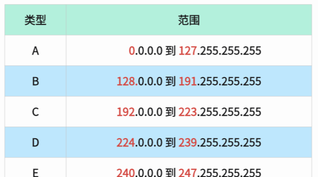
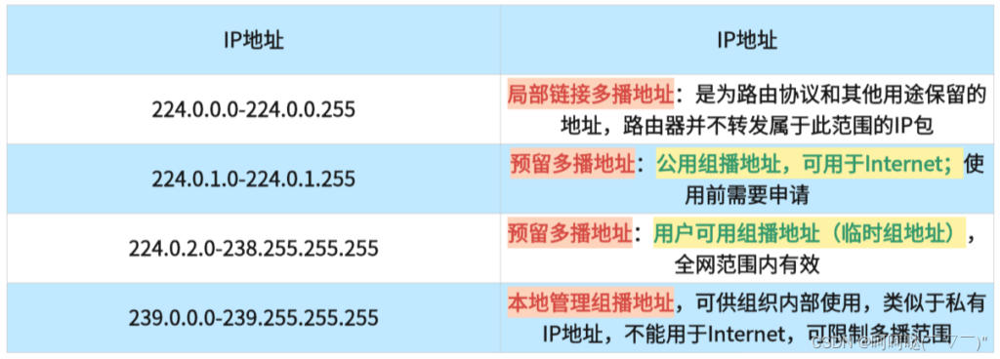

## UDP

- TCP、UDP是经常成对听到通信协议，但许多常用协议如HTTP（HTTP3之前基于TCP，HTTP3基于QUIC基于UDP），SSH等都是基于TCP实现，原因其实很明显，就是TCP的可靠性。

- 最近在实现跨设备共享本地歌曲和控制的时候，发现了UDP的妙用。本文并不提供代码实现，只是聊聊这个技术概念，方便你做功能时技术选择。

## 单播、组播和广播

- 这三种通信方式是UDP的一大特色。**TCP是全双工的一对一通信**！我们在服务器上能监听一个端口后与多个客户端通信是Socket的功劳。也就是说，TCP是一对一通信，socket实现了一对多通信。

- 而UDP与TCP不同，它本身就支持一对一和一对多通信。

- 因而UDP分出了三种通信方式：
    - 单播：一对一通信
    
    - 广播：一对多通信。客户端监听一个固定的端口{port1}，服务端只要向该网段的广播地址{addr1}和端口{port1}发送数据，该网段内所有监听这个端口{port1}的客户端都能收到信息。后面聊聊如何计算网段的广播地址。
    
    - 组播（多播）：一对多通信。客户端监听一个固定的端口{port1}，并选择一个组播地址{addr1}加入。然后服务端向这个组播地址{addr1}和端口{prot1}发送数据，则所有加入这一组的客户端都能收到信息。相比手动循环给每一个客户端发送显然要快。
    
    - 看起来广播和单播是两个极端，一个是一对一，一个是一对全部。而组播则是他们的取舍，能选择一组目标来发送数据。
    
    - **但组播和广播仍然是有区别的，组播可以跨网段，而广播不行**。

## 网段

- 我们得到分配的IP地址{ip}时，还会有一个子网掩码{mask}，两者相与 {ip} & {mask} 即可得到网段，例如：
    - IP地址 ip = 192.168.7.7
    
    - 子网掩码 mask = 255.255.255.0
    
    - {ip} & {mask} = 192.168.7.0
    
    - 因此该路由分配下来的IP地址一般就是 192.168.7.x
    
    - 注意子网掩码也可以是 255.255.0.0、255.255.240.0 等，看路由的设置
    

## 广播

- 实现广播的收发比较简单，客户端监听一个端口，服务端计算出目标客户端的网段的广播地址，然后向这个地址和端口发送数据即可。

- 注意服务端发送前**需要启用广播**（不同编程语言、不同库可能操作启用方式不同，请注意了解其使用方法 EnableBroadcast），然后发送的**目标地址必须是广播地址**（而且不能是 255.255.255.255，这个是受限地址），发送的**目标端口必须是客户端监听的端口**，因此客户端和服务器需要约定好通信端口。

- 关于广播地址的计算，比如：
    - IP地址 ip = 192.168.7.7
    
    - 子网掩码 mask = 255.255.255.0
    
    - 网段 {ip} & {mask} = 192.168.7.0
    
    - 将子网掩码转为二进制来看，11111111.11111111.11111111.00000000，按照其中0的位置，将网段的对应位置置为1，这里子网掩码为0的位置是最后8位，因此将网段转二进制后的最后8位置为1，再转回10进制即为 192.168.7.255

- 广播不能跨网段，比如：
    - 客户端1：
        - ip：192.168.7.7
        
        - 子网掩码：255.255.255.0
        
        - 网段 192.168.7.0
    
    - 客户端2：
        - ip：192.168.9.9
        
        - 子网掩码：255.255.255.0
        
        - 网段 192.168.9.0
    
    - 你向 192.168.7.255 发送广播时，仅客户端1能收到信息
    
    - 你向 192.168.9.255 发送广播时，仅客户端2能收到信息
    
    - **你向 192.168.255.255 发送广播时，客户端1 和 客户端2 都不能收到信息！**实践出真知，我试过！原本是以为用这个广播地址可以同时发给这两个客户端的，但实践结果是不行。

## 组播

- 客户端需要监听一个端口，并选择一个组播地址加入，而服务端需要向这个组播地址和端口发送数据即可。

- 组播地址是什么：

- 首先，IPv4地址是 4 \* 8 = 32 个bit，4字节大小

- 它的地址被规定划分成如下分类：

- 其中，整个D类地址都被作为组播地址使用，而且组播地址还有细分：

- 如果只在局域网内使用，则取 239.0.0.0-239.255.255.255 中的任意一个都可以。

- 组播地址是自选的，客户端和服务器需要约定好选择的组播地址和端口，当发送端的目标地址和端口与客户端加入的组播地址和监听端口相同时才会收到信息。

## 技术选择

- 在局域网内网络没有广域网那么复杂，UDP表现挺不错的，另外TCP不支持组播和广播，而UDP支持，这在实现局域网内客户端互相发现、通信时相当有用，可以让客户端加入一个组，然后群发消息时发送组播即可。

- 由于每个客户端本身也有IP，可利用组播或广播互相发现对方，并在收到消息时提取发送方的IP，当需要一对一通信即可用这个IP直接通信。

- 但是我在实现时，运行在win11和安卓上的客户端通过热点WIFI连接，组播消息经常收不到，因此最后是使用广播实现的，如果实际使用请注意测试各种用户常用的网络环境。

## 参考资料

### 组播

- https://blog.csdn.net/weixin\_41987016/article/details/132566896
