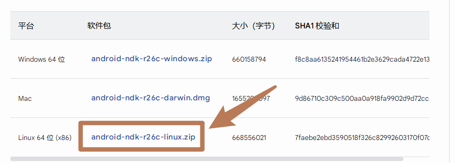
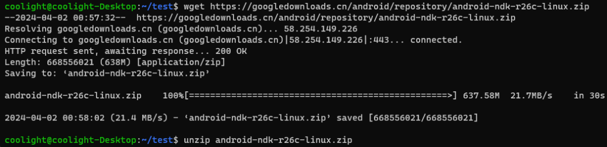
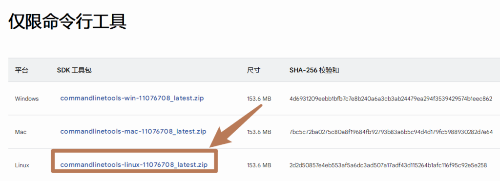
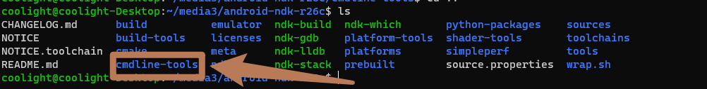
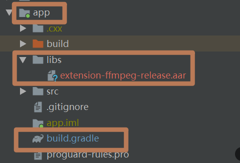

# [安卓/flutter]给Media3.exoplayer编译扩展ffmpeg解码器

## 前言

- 安卓的Exoplayer已经迁移到了Media3里面了，而且在安卓端，使用Exoplayer要比libmpv等播放组件要稳定一些，因此我们又引入了Exoplayer作为安卓端的播放组件。但它支持的音视频格式远不及libmpv内置的ffmpge，Exoplayer官方也支持了当遇到Exoplayer不支持的格式时转给其他扩展的库解码，这其中就包括了ffmpeg。

- 所以我们将要编译一个安卓的ffmpge包，然后配置给Media3.Exoplayer使用。

- 踩了很多坑，留篇帖子记录下。

## 引用文档

- [Media引入ffmpge官方文档](https://github.com/androidx/media/blob/release/libraries/decoder_ffmpeg/README.md)

- [ExoPlayer(AndroidX Media3) 扩展ffmpeg实现音频软解码](https://blog.csdn.net/gdfgdfasdas/article/details/136572994)

- [FFmpeg library Support Format](https://developer.android.com/media/media3/exoplayer/supported-formats?hl=en#ffmpeg-library)

- [Flutter plugin集成 aar 出现错误](https://www.jianshu.com/p/b124b45c2e1b)

## 准备

- 系统 Ubuntu 20.04；建议使用Ubuntu(linux)，官方并不提供windows编译支持

- JDK 17.0.6；你需要先安装好JDK

- NDK 、cmdtools、SDKManager（接下来会讲怎么装）

## 配置NDK 、cmdtools、SDKManager



- **首先是NDK**
    - 前往[**NDK官网**](https://developer.android.google.cn/ndk/downloads?hl=zh-cn)下载Linux版zip包，然后解压
        - 你可以将这个压缩包下载后传输到Ubuntu里
        
        - 也可以复制它的下载链接，然后在Ubuntu内下载，比如：

```
cd {你想放NDK的目录}
wget {官网复制Linux版的下载链接}
unzip {刚刚下载的zip文件}
```



- 解压完后cd进去，**接下来搞cmdtools**

- [前往下载cmdtools仅限命令行工具](https://developer.android.com/studio?hl=zh-cn)；点击进入网页后往下滑动，找**\[仅限命令行工具\]**，然后点击下载Linux版



- 注意，**你需要将这个压缩包下载或者移动到刚刚解压的NDK目录内**，然后解压即可得到cmdline-tools文件夹：



- **最后同意一下协议**

```
cd {cmdline-tools目录}/bin
sudo ./sdkmanager --licenses --sdk_root={你的NDK的根目录}
```

- 然后一路输入y同意即可

## 编译ffmpge

- $ cd {NDK目录}

- **设置NDK\_PATH变量**：

```
NDK_PATH="$(pwd)"
```

- **拉取适配Media3的ffmpeg模块**

```
cd {你想放Media3.decoder_ffmpeg的目录}
git clone https://github.com/androidx/media --depth 1
cd media
FFMPEG_MODULE_PATH="$(pwd)/libraries/decoder_ffmpeg/src/main"
```

- **设置编译平台：**

```
Lunux执行：
HOST_PLATFORM="linux-x86_64"

MacOX执行：
HOST_PLATFORM="darwin-x86_64"
```

- **设置最小支持Android版本**；通常为项目设置的minSDK版本，NDK版本r26最小支持SDK为21

```
ANDROID_ABI=21
```

- **下载ffmpeg源码**；下载源码并设置FFMPEG\_PATH变量

```
cd {你想放ffmpge源码的目录}
git clone git://source.ffmpeg.org/ffmpeg && \ cd ffmpeg && \ git checkout release/6.0 && \ FFMPEG_PATH="$(pwd)"
```

- **配置ffmpge解码器支持的格式**；根据自己需要解码的格式设置，[具体支持的解码格式参考官网](https://developer.android.com/guide/topics/media/exoplayer/supported-formats#ffmpeg-library)

```
ENABLED_DECODERS=(vorbis opus flac alac pcm_mulaw pcm_alaw mp3 amrnb amrwb aac ac3 eac3 dca mlp truehd)
```

- **关联ffmpeg源码**

```
cd "${FFMPEG_MODULE_PATH}/jni"
ln -s "$FFMPEG_PATH" ffmpeg
```

- **编译ffmpeg**

```
./build_ffmpeg.sh \ "${FFMPEG_MODULE_PATH}" "${NDK_PATH}" "${HOST_PLATFORM}" "${ANDROID_ABI}" "${ENABLED_DECODERS[@]}"
```

- 编译成功后，会在ffmepg目录下生成一个android-libs目录，里面就是生成的ffmpge动态库，先不要动它，让我们把它编译成aar，方便安卓项目引入。

- **编译生成Android项目依赖的aar包**

```
cd {开头放Media3.decoder_ffmpeg的目录}
./gradlew lib-decoder-ffmpeg:assembleRelease
```

- 等待编译完成后，会在{media源码目录}\\libraries\\decoder\_ffmpeg\\buildout\\outputs\\aar\\目录生成aar包

## 项目引入ffmpge的aar包

- 先将Ubuntu内我们刚刚编译好的arr包复制到 **{你的安卓项目}/app/libs/ 目录内**

- **普通的安卓项目**比较简单，直接修改 {你的安卓项目}/app/build.gradle 文件，找到 dependencies {} 块填入依赖即可：

```

dependencies {
    implementation(fileTree('libs'))
}
```



- 但我们是**Flutter项目**，要复杂一些，我们是新建了一个flutter插件，然后插件引入了这个aar包，flutter主项目再引入这个插件的（[参考文章](https://www.jianshu.com/p/b124b45c2e1b)）

- 对于flutter插件项目，如果仍按上面的普通安卓项目方式导入，会导致**编译错误**（Error while evaluating property 'hasLocalAarDeps' of task ':xxxx）或是**运行时错误**（java.lang.NoClassDefFoundError: Failed resolution of: Landroidx/media3/decoder/ffmpeg/FfmpegAudioRenderer）（java.lang.ClassNotFoundException）
    - 把aar复制到 **{插件目录}android/libs/** 文件夹中
    
    - 在插件的android目录的根部（和src同级）新建aar\_tools.gradle文件。
    
    - 在文件内写入以下内容，**注意修改\[copyAar2Host\]的参数**为你的插件包名：

```
import java.util.zip.ZipEntry
import java.util.zip.ZipFile

// 把aar拷贝进入主项目的方法 exampleName 换成你自己的插件名
// - 如果不清楚要填什么名，就解注释下面的 copyAar2Host::rootProject.allprojects.each::println("<<${p.name}|${p.group}>> isHost ? ${isApp}")，然后跑一下编译就会把目标名称打印出来，即 ${p.name}
// - 只修改下面这一行的参数就可以了
copyAar2Host('exampleName')

// 拷贝aar的方法
static aarFileCopy(String srcPath,String desPath) {
    System.out.println("copy aar from <<${srcPath}>> to <<${desPath}>>")
    try {
        FileInputStream fis = new FileInputStream(srcPath)
        FileOutputStream fos = new FileOutputStream(desPath)
        byte[] data = new byte[1024*8]
        int len = 0
        while ((len = fis.read(data))!=-1) {
            fos.write(data,0,len)
        }
        fis.close()
        fos.close()
    }catch(Exception e) {
        e.printStackTrace()
    }
}

void copyAar2Host(String pluginName) {
    Project currentProject = null
    Project appProject = null
    rootProject.allprojects.each {
        p -> {
            boolean  isApp = p.plugins.hasPlugin("com.android.application")
            // println("<<${p.name}|${p.group}>> isHost ? ${isApp}")
            if (p.name == pluginName) {
                currentProject = p
                println("Plugin project name is $currentProject")
            }
            if(isApp) {
                appProject = p
                println("Host project name is <<${p.name}>>")
            }
        }
    }
    Set<File> aarFiles = new HashSet<File>()
    if (appProject != null && currentProject != null) {
        File libs = new File("${currentProject.projectDir}","libs")
        if(libs.isDirectory()) {
            libs.listFiles().each {
                f->
                    if(f.name.endsWith(".aar")) {
                        println("The aar file name to be copied is <<${f.name}>>")
                        aarFiles.add(f)
                    }

            }
        }
        if (!aarFiles.isEmpty()) {
            File applibs = new File("${appProject.projectDir}${File.separator}libs")
            if(!applibs.isDirectory()) {
                applibs.mkdirs()
            }
            aarFiles.each {
                f->
                    File copyAar = new File("${appProject.projectDir}${File.separator}libs",f.name)
                    if(!copyAar.exists()) {
                        copyAar.createNewFile()
                        aarFileCopy(f.path,copyAar.path)
                    } else {

                    }
            }
            appProject.dependencies {
                implementation fileTree(dir:"${appProject.projectDir}${File.separator}libs",include:["*.jar","*.aar"])
            }
        }
    }
}

repositories{
    flatDir {
        dirs 'libs'
    }
}
```

- 在 {插件目录}/android/build.gradle 文件的 apply plugin: 'com.android.library' 下一行位置插入apply from: './aar\_tools.gradle'，并确保这个文件中对aar的依赖是compileOnly

```
apply plugin: 'com.android.library'
// 在这里插入下面这一行
apply from: './aar_tools.gradle'

// 然后找到dependencies块，
dependencies {
    // 这一行导入刚刚libs目录内的ffmpge的arr包

    compileOnly(fileTree("libs"))
    // 这里用于解决用android studio打开项目的android目录时里面的java/kotlin文件的import都是灰色的问题
    compileOnly files("$flutterRoot/bin/cache/artifacts/engine/android-arm/flutter.jar")
    compileOnly("androidx.annotation:annotation:1.3.0")
}
```

## 在代码里引入ffmpeg

- 最后是给Media3配置ffmpeg解码器

- 找到你初始化 Media3.Exoplayer 的 java 文件，然后增加一个类：

```

import androidx.media3.decoder.ffmpeg.FfmpegAudioRenderer;

class FfmpegRenderersFactory extends DefaultRenderersFactory {
    public FfmpegRenderersFactory(Context context) {
        super(context);
        setExtensionRendererMode(DefaultRenderersFactory.EXTENSION_RENDERER_MODE_ON);
    }

    @Override
    protected void buildAudioRenderers(Context context, int extensionRendererMode, MediaCodecSelector mediaCodecSelector, boolean enableDecoderFallback, AudioSink audioSink, Handler eventHandler, AudioRendererEventListener eventListener, ArrayList<Renderer> out) {
        out.add(new FfmpegAudioRenderer(eventHandler, eventListener, audioSink));
        super.buildAudioRenderers(context, extensionRendererMode, mediaCodecSelector, enableDecoderFallback, audioSink, eventHandler, eventListener, out);
    }
}
```

- 修改初始化 Media3.Exoplayer 的部分代码：

```

ExoPlayer.Builder builder = new ExoPlayer.Builder(context);
// 添加ffmpeg

builder.setRenderersFactory(new FfmpegRenderersFactory(context));
ExoPlayer player = builder.build();
```
