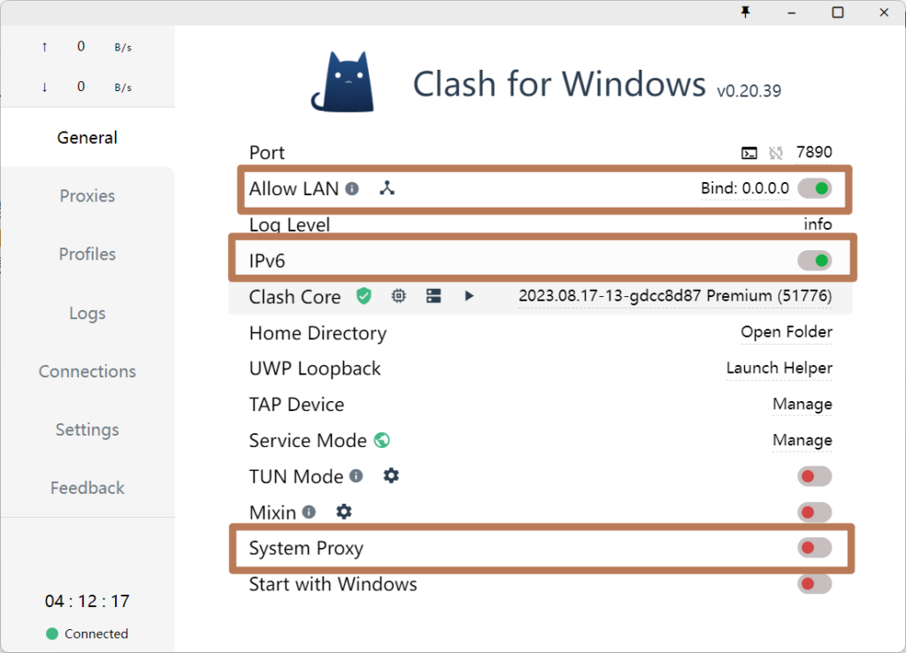
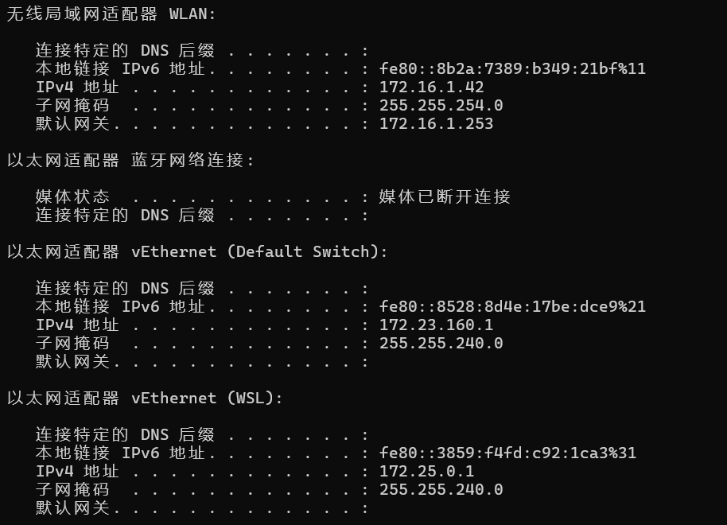
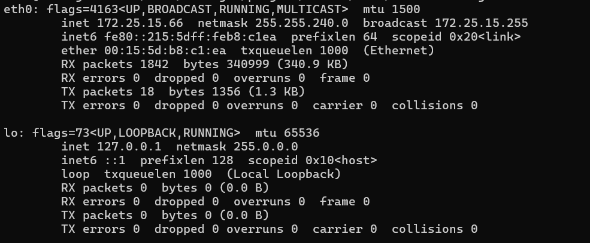

# 为Ubuntu/WSL/Linux配置系统代理；挂到clash-win

## 系统代理

- 由于国内访问外国的部分网站，如谷歌、docker等下载资源时容易被墙，导致timeout超时或是失败，因此一般可以通过换国内源或配置代理解决。

* * *

## 配置/取消系统代理

### 配置http/https代理：

- 在命令行输入：

```
export http_proxy=http://{代理ip}:{代理端口}
export https_proxy=http://{代理ip}:{代理端口}
```

- 注意：
    - https\_proxy同样配置http://即可，不需要用https://
    
    - 要用export，而不是set
    
    - 在命令行这样配置后是临时的，仅当前ssh窗口生效，关闭重开就失效了
    
    - 如需永久生效，可以在环境配置文件里搞，如 /etc/profile

### 取消代理

- 在命令行输入：

```
unset http_proxy
unset https_proxy
```

* * *

## 由clash-win来代理

- 我的开发环境在win端，小猫咪clash也在win端，目标是把wsl的流量转到win端来代理，以下操作同样适用于将局域网内的机子（同事的机子/公司内测试的虚拟机）的流量转到自己的windows电脑代理。

- 首先你的win端的猫clash得是正常能用的，并确保以下功能开启：
    - 注意第一行，猫的监听端口是7890，如果你自己改了一个端口，那么后面的操作也得用你自己的端口。
    
    - Allow Lan: 监听 0.0.0.0，接收代理非本机的流量；不开启时监听127.0.0.1，则只能接收本机流量。
    
    - IPv6：ipv6支持，最好开
    
    - System proxy：猫开启代理



- 然后在本机win端打开cmd：

```
ipconfig
```

- 控制台会显示本机网络信息，然后看你自己的情况选择一个本机IPv4的ip，目标是找到一个能和ubuntu通信的ip：
    - 如果你是想给wsl代理流量，可以找适配器名称为 WSL 的IP，如图最底下的IPV4：172.25.0.1
    
    - 如果是想给局域网内的其他设备代理，连在同一个Wifi则找WLAN的，如图最顶上的 WLAN的IPV4：172.16.1.42



- 然后在ubuntu内的控制台输入：

```
ifconfig
```

- 此时输出的是ubuntu的网卡信息，同样的找一个能和win通信的ip：
    - 应当找和win端的ip在同一网段的，需要和子网掩码计算。简单点说就是ip比较接近的，一般前几个数会相等。



- 接下来是检查互相是否能ping通

- 首先是ubuntu来ping win端，在ubuntu的控制台输入：

```
ping {win的ip}
```

- 如果不能ping通，则将win的防火墙关了再ping试试（或只开放防火墙的某个ip和端口）, 打开cmd执行:

```
netsh advfirewall set allprofiles state off
```

- 然后是win端 ping ubuntu，在win端的cmd控制台输入：

```
ping {ubuntu的ip}
```

- 如果不能ping通，则将ubuntu的防火墙关闭再试试，在ubuntu的控制台输入以下命令关闭防火墙：

```
sudo ufw disable
```

- 能互相ping通后，在ubuntu的控制台配置代理：

```
export http_proxy=http://{win的ip}:{猫的端口，默认7890}
export https_proxy=http://{win的ip}:{猫的端口，默认7890}
```

- 注意win端的猫代理打开就ok了
