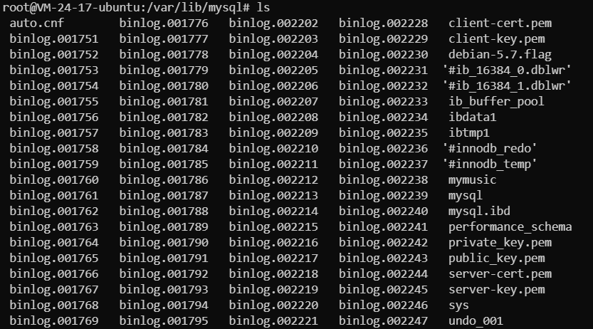

## 现象

- top查看mysql的内存占用比平时高了很多，到60%多，cpu占用也大

- 经常报 too many connections

## 解决

- 查看mysql当前连接数量：

```
// 进入 mysql 内，执行： 
mysql> SHOW STATUS LIKE 'Threads_connected';
```

- 调大mysql的最大连接数：

```
// 进入 mysql 内，执行：
mysql> SET GLOBAL max_connections = 1000;
```

- 后来随手检查了下各种硬件资源，发现硬盘满了：

```
$ df -h
```

- 然后看了眼 mysql 的日志目录： /var/lib/mysql/



- 上面是已经删了一些，一开始特别多，占了50%的硬盘，直接把旧的日志全删了就好多了：

```
$ rm binlog.0017*
```

- 清理后 mysql 就恢复正常了
