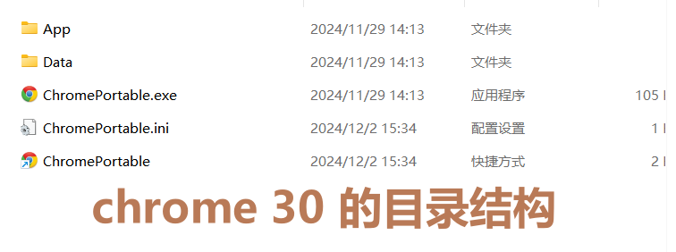

## 前言

- 最近项目需要测试 JS 在不同浏览器的兼容性，因此需要安装不同浏览器的多个版本，便于切换测试和适配。

- 主要聊的是 chrome/firefox/IE

## 谷歌浏览器 chrome

- chrome 官方包一安装就会覆盖之前的版本，因此得借助 **GoogleChromePortable** ，它可以放多个版本chrome进去，然后启动前更改文件夹名称即可：

- 下载网站，**如果进不去就挂梯子/vpn**：
    - **GoogleChromePortable** 必须下载安装，安装最新版本即可：[点击前往](https://portableapps.com/apps/internet/google_chrome_portable/)
    
    - chrome 历史版本：
        - [点击前往下载网站-1](https://www.chromedownloads.net/chrome64win-stable/list_2_1.html)；这个能下载到最老是 39 （2015/01）
        
        - [点击前往下载网站-](https://downzen.com/en/windows/google-chrome/versions/?page=11)2；这个能下载最老的版本是 50（2016/04），但中间 76（2019/06）-50 的版本缺失了，网站里后面的下载大小为0就是缺少：

- 安装好 **GoogleChromePortable** 之后，找到它的安装目录：
    - App：里面就可以存放多个不同版本的 chrome
    
    - GoogleChromePortable.exe 启动器，想运行时双击它

- 然后安装一个 chrome 版本，安装完成后找到它的安装目录，一般它会只有一个 Application 目录，点进去长这样；如果不是先别操作，看后面 chrome30的处理办法：

- 然后回退到 Chrome 文件夹，把整个 Application 目录剪切拖到刚刚的 GoogleChromePortable 的安装目录/App 中，并重命名 Chrome-bin-{简单版本号}：

- 然后等你想启动这个版本的时候，就把那个版本改名为 Chrome-bin 再回到上一层文件夹双击 GoogleChromePortable.exe 即可：

- 那如果像 chrome 30 版本，它的目录结构更像 GoogleChromePortable，就不要这么操作了，直接给它放在外面一个目录，像启动就直接双击里面的 chromePortable.exe 即可：

## 火狐 firefox

- 火狐比较简单，安装时选择自定义安装，然后安装在不同目录即可。

- 下载链接：[点击前往下载](http://ftp.mozilla.org/pub/mozilla.org//firefox/releases/)

- 下载一个火狐安装包，然后点击安装，点击下一步：

- 选择 **自定义安装**：

- 然后多个火狐选择不同目录安装即可：

## IE

- IE 不需要额外下载了，不少浏览器里的兼容模式就是 IE 内核。测试时建议同时打开 开发者工具，可能打开了运行效果才会正常！

- 可以在 edge 里安装插件 IEability ，**[点击前往安装](https://microsoftedge.microsoft.com/addons/detail/ieability-open-in-ie/ladagfjapiedpgikoonalfbhldpienih)**，然后进入页面后点击右上角即可启动 IE：

- f12 打开开发者工具后可以切换 IE 版本：

- 或者 360 极速浏览器 进入网页后，点击右上角地址栏右边的三个点，选择兼容模式：

- 然后在网页里鼠标右键即可选择 IE 版本：

