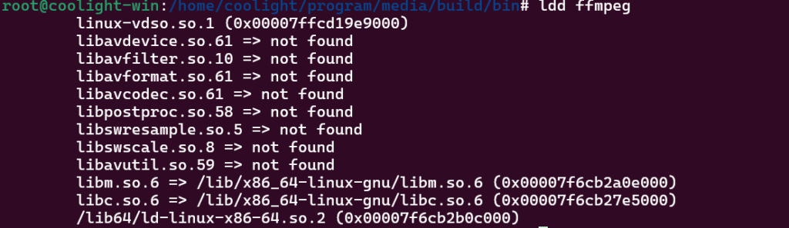
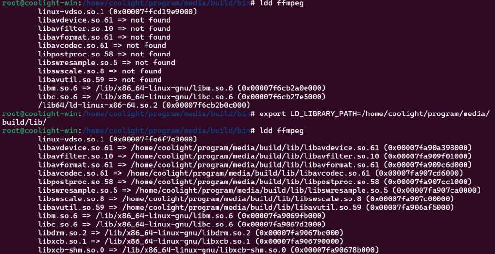

## 参考编译教程博客

- [https://blog.csdn.net/weixin\_50873490/article/details/143258969](https://blog.csdn.net/weixin_50873490/article/details/143258969)

- [https://blog.csdn.net/u012959478/article/details/140901775](https://blog.csdn.net/u012959478/article/details/140901775)

## 问题解决

- 跟着参考博客走的时候遇到了一些问题，这里记录一下怎么解决。

### Ubuntu的 meson 版本太老

- 直接用apt安装的比较老，可以用 python 的 pip 安装，先删除已有的apt安装的 meson 

```
apt remove meson
pip3 install --upgrade meson
```

### fdk-aac 编译失败

- 第一篇博客比较老，这个的编译应该跟着第二篇博客编译

### ASM 支持

- gcc 报错 cannot find crt1.0：
    - apt install gcc-multilib

- ffmpeg 编译提示 --disable-x86asm ... 缺少 nasm 或 yasm：
    - apt install nasm yasm

### 编译 ffmpeg 时报错找不到 x265

- ffmpeg 编译失败会提示查看日志 ffbuild/config.log，里面提到 pkg-config 未找到 x265，但它能找到 x264，去翻了他们 install 的位置发现，x264 会在生成 lib/pkgconfig/x264.pc 来帮助查找包，而 x265 没有，所以我们可以照着 x264.pc 抄一份：

- 在 {install 目录}/lib/pkgconfig/ 下创建文件 vim x265.pc，然后写入：
    - 抄完 x264.pc 后尝试编译遇到报错：
        - 找不到 new/delete 等 c++ 符号，x265 需要额外链接 c++标准库 -lstdc++
        
        - 找不到 numa 相关的一些符号，需要链接 -lnuma

```
prefix={x265的install目录}
exec_prefix=${prefix}
libdir=${exec_prefix}/lib
includedir=${prefix}/include

Name: x265
Description: H.265 (MPEG4 AVC) encoder library
Version: 3.4
Libs: -L${exec_prefix}/lib -lx265 -lpthread -lm -ldl -lstdc++ -lnuma
Libs.private:
Cflags: -I${prefix}/include
```

## 运行 ffmpeg 找不到依赖的动态库

- 如果自定义 ffmpeg 的install目录，会发现运行时找不到依赖的动态库，尝试 ldd ffmpeg 查看依赖库：



- 这是因为自定义的目录不在动态库查找目录列表中，要么在 /etc/ld.config 里面添加，要么临时添加环境变量：

```
export LD_LIBRARY_PATH={so库所在的目录}
./ffmpeg
```


