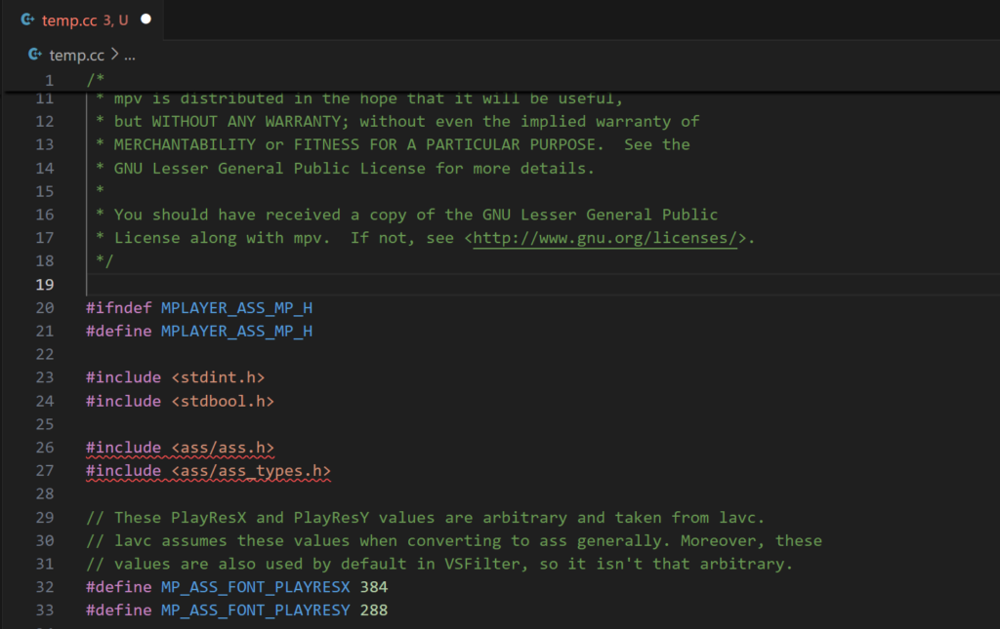
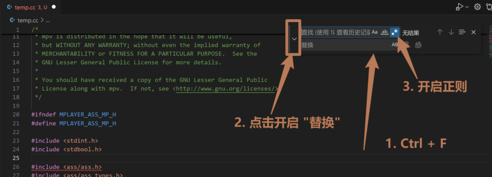
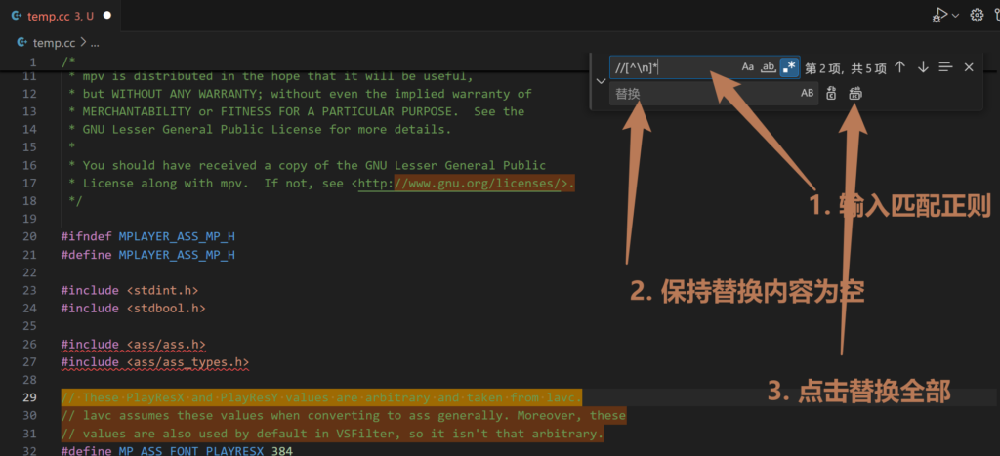

# [小工具] c/c++/js等代码去空行/注释

## 前言

- 由于申请软著需要贴代码，而且不能放注释和空行，本来想找在线网站解决的，但没找到，所以用vscode 的正则匹配替换实现。

## vscode 正则替换

- 在 vscode 新建一个 txt 文件

- 把代码全部复制进去：

- 然后在vscode内按 Ctrl+F，调出查找，并开启 替换 和 正则匹配：

- 接下来输入下面的正则到 “查找框”，保持 “替换框” 为空白即可将匹配的内容移除：

## 移除注释

- 移除 // 注释：
    - //\[^\\n\]\*

- 移除 /\* \*/ 注释：
    - \\/\*\[\\w\\W\]_\*\\/_

## 移除空行

- _^\\s_\\n
