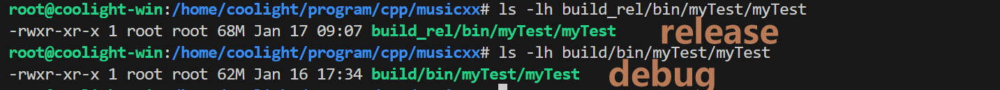
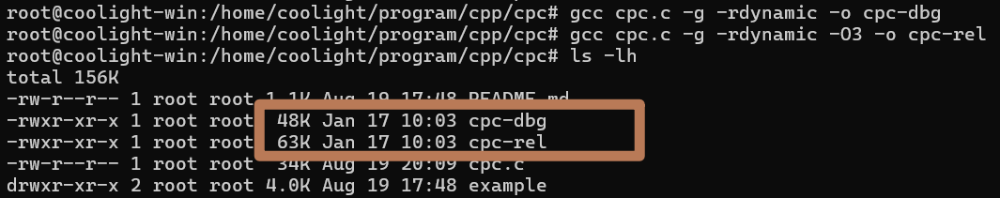
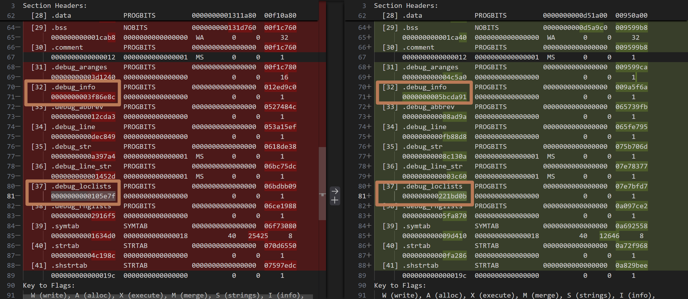

# [gcc] O3比O0生成文件更大

## 前言
- 最近发现 gcc 在编译时添加 -g 后，启用优化 O3 生成的可执行文件大小会明显比 O0 更大
- 挺有意思的，按之前的经验，往往都是启用优化，即 release 应当比 debug 小特别多。
- 之所以这次需要在 O3 的同时添加 -g，是为了在段错误崩溃时能打印堆栈信息，如果不添加调试信息（符号表、行号等），打印出来只有一些地址。

## 过程
- 首先是直接用 gcc 编译生成二进制对比看看，可以发现 release 生成的更大：

- 换一个代码更简单的试试也是一样：

- 接下来我们用 readelf 看一下可执行程序的分段大小，看看到底是哪里有偏差
    - 下面是一个程序的 debug（118 MB）和 release（169 MB）对比
    - debug :
```txt
There are 42 section headers, starting at offset 0x7598078:

Section Headers:
  [Nr] Name              Type             Address           Offset
       Size              EntSize          Flags  Link  Info  Align
  [ 0]                   NULL             0000000000000000  00000000
       0000000000000000  0000000000000000           0     0     0
  [ 1] .interp           PROGBITS         0000000000400350  00000350
       000000000000001c  0000000000000000   A       0     0     1
  [ 2] .note.gnu.pr[...] NOTE             0000000000400370  00000370
       0000000000000020  0000000000000000   A       0     0     8
  [ 3] .note.ABI-tag     NOTE             0000000000400390  00000390
       0000000000000020  0000000000000000   A       0     0     4
  [ 4] .hash             HASH             00000000004003b0  000003b0
       000000000004264c  0000000000000004   A       6     0     8
  [ 5] .gnu.hash         GNU_HASH         0000000000442a00  00042a00
       000000000004a030  0000000000000000   A       6     0     8
  [ 6] .dynsym           DYNSYM           000000000048ca30  0008ca30
       00000000000ce550  0000000000000018   A       7     1     8
  [ 7] .dynstr           STRTAB           000000000055af80  0015af80
       0000000000345511  0000000000000000   A       0     0     1
  [ 8] .gnu.version      VERSYM           00000000008a0492  004a0492
       000000000001131c  0000000000000002   A       6     0     2
  [ 9] .gnu.version_r    VERNEED          00000000008b17b0  004b17b0
       00000000000002b0  0000000000000000   A       7     5     8
  [10] .rela.dyn         RELA             00000000008b1a60  004b1a60
       0000000000005610  0000000000000018   A       6     0     8
  [11] .rela.plt         RELA             00000000008b7070  004b7070
       0000000000001f08  0000000000000018  AI       6    27     8
  [12] .init             PROGBITS         00000000008b9000  004b9000
       0000000000000020  0000000000000000  AX       0     0     4
  [13] .plt              PROGBITS         00000000008b9020  004b9020
       00000000000014c0  0000000000000010  AX       0     0     16
  [14] .plt.got          PROGBITS         00000000008ba4e0  004ba4e0
       0000000000000088  0000000000000008  AX       0     0     8
  [15] .text             PROGBITS         00000000008bb000  004bb000
       0000000000728762  0000000000000000  AX       0     0     4096
  [16] .fini             PROGBITS         0000000000fe3764  00be3764
       000000000000000d  0000000000000000  AX       0     0     4
  [17] .rodata           PROGBITS         0000000000fe4000  00be4000
       00000000000b97dd  0000000000000000   A       0     0     64
  [18] .eh_frame_hdr     PROGBITS         000000000109d7e0  00c9d7e0
       0000000000055664  0000000000000000   A       0     0     4
  [19] .eh_frame         PROGBITS         00000000010f2e48  00cf2e48
       0000000000163398  0000000000000000   A       0     0     8
  [20] .gcc_except_table PROGBITS         00000000012561e0  00e561e0
       0000000000049fea  0000000000000000   A       0     0     4
  [21] .tbss             NOBITS           00000000012a1a18  00ea0a18
       0000000000000081  0000000000000000 WAT       0     0     8
  [22] .init_array       INIT_ARRAY       00000000012a1a18  00ea0a18
       0000000000000160  0000000000000008  WA       0     0     8
  [23] .fini_array       FINI_ARRAY       00000000012a1b78  00ea0b78
       0000000000000008  0000000000000008  WA       0     0     8
  [24] .data.rel.ro      PROGBITS         00000000012a1b80  00ea0b80
       000000000006ef80  0000000000000000  WA       0     0     32
  [25] .dynamic          DYNAMIC          0000000001310b00  00f0fb00
       0000000000000220  0000000000000010  WA       7     0     8
  [26] .got              PROGBITS         0000000001310d20  00f0fd20
       00000000000002c8  0000000000000008  WA       0     0     8
  [27] .got.plt          PROGBITS         0000000001311000  00f10000
       0000000000000a70  0000000000000008  WA       0     0     8
  [28] .data             PROGBITS         0000000001311a80  00f10a80
       000000000000bce0  0000000000000000  WA       0     0     64
  [29] .bss              NOBITS           000000000131d760  00f1c760
       000000000001cab8  0000000000000000  WA       0     0     32
  [30] .comment          PROGBITS         0000000000000000  00f1c760
       0000000000000012  0000000000000001  MS       0     0     1
  [31] .debug_aranges    PROGBITS         0000000000000000  00f1c780
       00000000003d1240  0000000000000000           0     0     16
  [32] .debug_info       PROGBITS         0000000000000000  012ed9c0
       0000000003f86e8c  0000000000000000           0     0     1
  [33] .debug_abbrev     PROGBITS         0000000000000000  0527484c
       000000000012cda3  0000000000000000           0     0     1
  [34] .debug_line       PROGBITS         0000000000000000  053a15ef
       0000000000dec849  0000000000000000           0     0     1
  [35] .debug_str        PROGBITS         0000000000000000  0618de38
       0000000000a397a4  0000000000000001  MS       0     0     1
  [36] .debug_line_str   PROGBITS         0000000000000000  06bc75dc
       000000000001452d  0000000000000001  MS       0     0     1
  [37] .debug_loclists   PROGBITS         0000000000000000  06bdbb09
       0000000000105e7f  0000000000000000           0     0     1
  [38] .debug_rnglists   PROGBITS         0000000000000000  06ce1988
       00000000002916f5  0000000000000000           0     0     1
  [39] .symtab           SYMTAB           0000000000000000  06f73080
       00000000001634d0  0000000000000018          40   25425     8
  [40] .strtab           STRTAB           0000000000000000  070d6550
       00000000004c198c  0000000000000000           0     0     1
  [41] .shstrtab         STRTAB           0000000000000000  07597edc
       000000000000019c  0000000000000000           0     0     1
Key to Flags:
  W (write), A (alloc), X (execute), M (merge), S (strings), I (info),
  L (link order), O (extra OS processing required), G (group), T (TLS),
  C (compressed), x (unknown), o (OS specific), E (exclude),
  R (retain), D (mbind), l (large), p (processor specific)
```
    - release :
```txt
There are 42 section headers, starting at offset 0xa829d90:

Section Headers:
  [Nr] Name              Type             Address           Offset
       Size              EntSize          Flags  Link  Info  Align
  [ 0]                   NULL             0000000000000000  00000000
       0000000000000000  0000000000000000           0     0     0
  [ 1] .interp           PROGBITS         0000000000400350  00000350
       000000000000001c  0000000000000000   A       0     0     1
  [ 2] .note.gnu.pr[...] NOTE             0000000000400370  00000370
       0000000000000020  0000000000000000   A       0     0     8
  [ 3] .note.ABI-tag     NOTE             0000000000400390  00000390
       0000000000000020  0000000000000000   A       0     0     4
  [ 4] .hash             HASH             00000000004003b0  000003b0
       0000000000015e10  0000000000000004   A       6     0     8
  [ 5] .gnu.hash         GNU_HASH         00000000004161c0  000161c0
       0000000000019804  0000000000000000   A       6     0     8
  [ 6] .dynsym           DYNSYM           000000000042f9c8  0002f9c8
       0000000000053298  0000000000000018   A       7     1     8
  [ 7] .dynstr           STRTAB           0000000000482c60  00082c60
       000000000008eea3  0000000000000000   A       0     0     1
  [ 8] .gnu.version      VERSYM           0000000000511b04  00111b04
       0000000000006ee2  0000000000000002   A       6     0     2
  [ 9] .gnu.version_r    VERNEED          00000000005189e8  001189e8
       00000000000002c0  0000000000000000   A       7     5     8
  [10] .rela.dyn         RELA             0000000000518ca8  00118ca8
       0000000000005700  0000000000000018   A       6     0     8
  [11] .rela.plt         RELA             000000000051e3a8  0011e3a8
       0000000000001da0  0000000000000018  AI       6    27     8
  [12] .init             PROGBITS         0000000000521000  00121000
       0000000000000020  0000000000000000  AX       0     0     4
  [13] .plt              PROGBITS         0000000000521020  00121020
       00000000000013d0  0000000000000010  AX       0     0     16
  [14] .plt.got          PROGBITS         00000000005223f0  001223f0
       0000000000000080  0000000000000008  AX       0     0     8
  [15] .text             PROGBITS         0000000000523000  00123000
       0000000000610622  0000000000000000  AX       0     0     4096
  [16] .fini             PROGBITS         0000000000b33624  00733624
       000000000000000d  0000000000000000  AX       0     0     4
  [17] .rodata           PROGBITS         0000000000b34000  00734000
       0000000000088498  0000000000000000   A       0     0     64
  [18] .eh_frame_hdr     PROGBITS         0000000000bbc498  007bc498
       00000000000230cc  0000000000000000   A       0     0     4
  [19] .eh_frame         PROGBITS         0000000000bdf568  007df568
       00000000000c4e28  0000000000000000   A       0     0     8
  [20] .gcc_except_table PROGBITS         0000000000ca4390  008a4390
       000000000003b831  0000000000000000   A       0     0     4
  [21] .tbss             NOBITS           0000000000ce1018  008e0018
       0000000000000088  0000000000000000 WAT       0     0     8
  [22] .init_array       INIT_ARRAY       0000000000ce1018  008e0018
       0000000000000160  0000000000000008  WA       0     0     8
  [23] .fini_array       FINI_ARRAY       0000000000ce1178  008e0178
       0000000000000008  0000000000000008  WA       0     0     8
  [24] .data.rel.ro      PROGBITS         0000000000ce1180  008e0180
       000000000006f700  0000000000000000  WA       0     0     32
  [25] .dynamic          DYNAMIC          0000000000d50880  0094f880
       0000000000000220  0000000000000010  WA       7     0     8
  [26] .got              PROGBITS         0000000000d50aa0  0094faa0
       0000000000000550  0000000000000008  WA       0     0     8
  [27] .got.plt          PROGBITS         0000000000d51000  00950000
       00000000000009f8  0000000000000008  WA       0     0     8
  [28] .data             PROGBITS         0000000000d51a00  00950a00
       0000000000008fb8  0000000000000000  WA       0     0     64
  [29] .bss              NOBITS           0000000000d5a9c0  009599b8
       000000000001ca40  0000000000000000  WA       0     0     32
  [30] .comment          PROGBITS         0000000000000000  009599b8
       0000000000000012  0000000000000001  MS       0     0     1
  [31] .debug_aranges    PROGBITS         0000000000000000  009599ca
       000000000004c5a0  0000000000000000           0     0     1
  [32] .debug_info       PROGBITS         0000000000000000  009a5f6a
       0000000005bcda91  0000000000000000           0     0     1
  [33] .debug_abbrev     PROGBITS         0000000000000000  065739fb
       000000000008ad9a  0000000000000000           0     0     1
  [34] .debug_line       PROGBITS         0000000000000000  065fe795
       0000000000fb88d8  0000000000000000           0     0     1
  [35] .debug_str        PROGBITS         0000000000000000  075b706d
       00000000008c130a  0000000000000001  MS       0     0     1
  [36] .debug_line_str   PROGBITS         0000000000000000  07e78377
       0000000000003c60  0000000000000001  MS       0     0     1
  [37] .debug_loclists   PROGBITS         0000000000000000  07e7bfd7
       000000000221bd0b  0000000000000000           0     0     1
  [38] .debug_rnglists   PROGBITS         0000000000000000  0a097ce2
       00000000005fa870  0000000000000000           0     0     1
  [39] .symtab           SYMTAB           0000000000000000  0a692558
       000000000009d410  0000000000000018          40   12646     8
  [40] .strtab           STRTAB           0000000000000000  0a72f968
       00000000000fa286  0000000000000000           0     0     1
  [41] .shstrtab         STRTAB           0000000000000000  0a829bee
       000000000000019c  0000000000000000           0     0     1
Key to Flags:
  W (write), A (alloc), X (execute), M (merge), S (strings), I (info),
  L (link order), O (extra OS processing required), G (group), T (TLS),
  C (compressed), x (unknown), o (OS specific), E (exclude),
  R (retain), D (mbind), l (large), p (processor specific)
```
- 用 git 对比一下，可以发现，主要是 `debug_info`（+） 和 `debug_loclists` 段大幅增加了：

- 经过一顿搜索和 AI 后，基本结论是：
    - 无优化时，源代码和汇编指令的对应关系比较准确，此时生成的调试信息比较简单。
    - 开启优化后，源码和汇编指令的对应比较复杂，因此需要更多信息来记录这些关系。