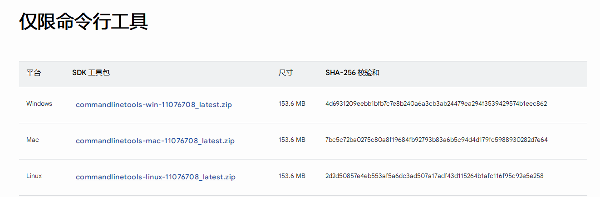
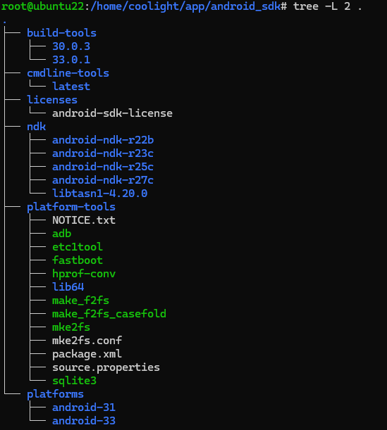
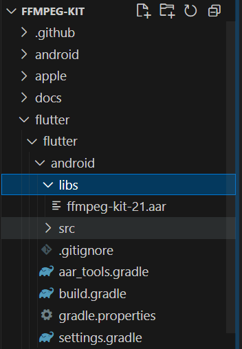

# [android/flutter] ffmpeg-kit 编译

## 前言
- [ffmpeg-kit](https://github.com/arthenica/ffmpeg-kit) 已经宣布不更新了，而且在逐渐删掉预编译的二进制文件，仓库只留了代码。
- 最近 flutter 编译时报错无法下载 ffmpeg-kit 对应的安卓包，应该是已经删除了，所以我们得自己编译一个。

## 编译条件
- 需要编译 ffmpeg-kit-5.1-LTS，并让 ffmpeg_kit_flutter 导入使用，修改 android api 为21
- Ubuntu 22
- ndk：r22b
- [参考](https://blog.csdn.net/RQ997832/article/details/145592620)，可以根据这里头先装好部分环境

## 环境安装
### jdk
- 先在命令行查看有没有装 jdk，没有再去装一个
```sh
javac --version
java --version
```
- 直接 apt 装 openjdk 即可
```sh
sudo apt install default-jdk
```

### 创建目录存放安卓编译环境
- 到 /home 里面 mkdir 一个目录出来，用来存放安卓编译环境
```sh
cd /home/{username}
mkdir android_sdk
```

### AndroidSDK
- 装个命令行工具即可，在 [安卓官网](https://developer.android.com/studio?hl=zh-cn) 下载，滑动到页面底下：

- 把它下载并解压到刚刚创建的文件夹内：
```sh
cd android_sdk
wget https://dl.google.com/android/repository/commandlinetools-linux-11076708_latest.zip?hl=zh-cn
unzip {压缩包文件名}

cd cmdline-tools
mkdir latest
mv {刚刚解压的所有文件} latest/

cd latest
sdkmanager --list
sdkmanager "platform-tools" "platforms;android-33" "build-tools;33.0.1"

## 配置环境变量
vim ~/.bashrc
```
- 在 `.bashrc` 中底部添加以下内容：
```sh
# 配置AndroidSDK环境
export ANDROID_SDK_ROOT=/home/{用户名}/android_sdk
export PATH=$PATH:$ANDROID_SDK_ROOT/cmdline-tools/latest/bin
```
- 保存退出后，在命令行执行生效：
```sh
source ~/.bashrc
```

### ndk
- ndk 下载: [最新](https://developer.android.google.cn/ndk/downloads?hl=zh-cn), [历史版本](https://github.com/android/ndk/wiki/Unsupported-Downloads)
- ffmpeg-kit 不同版本对 ndk 的要求是不一样的，可以看看[官方文档](https://github.com/arthenica/ffmpeg-kit/wiki/NDK-Compatibility)
- 这里我们要编译 5.1-LTS，所以选择 r22b, 之前尝试过使用更高的 ndk 编译，但有些库会报错，手动一个一个修完还是很多错，不想折腾了就换回来了。
- 把它解压放到 `android_sdk/ndk/{对应版本}` 中
- 然后 `vim ~/.bashrc` 添加环境变量：
```sh
# 配置AndroidSDK环境
export ANDROID_NDK_ROOT=/opt/program-tools/AndroidSDK/ndk/android-ndk-r22b
export PATH=$PATH:$ANDROID_NDK_ROOT
```
- 保存退出，在命令行执行：
```sh
source ~/.bashrc
ndk-build -v
```

### android_sdk 目录结构
- 主要是 cmdline-tools 和 ndk，其他都是自动搞进来的


### 依赖库
- apt 安装以下包：
```sh
apt install autoconf automake libtool pkg-config curl git doxygen nasm
```
- 还有一些可选包：
```sh
apt install cmake gcc gperf texinfo yasm bison autogen wget autopoint meson ninja ragel groff gtk-doc-tools libtasn1-1
```

### 安装libtasn1-1
```sh
# 下载解压
wget http://ftp.gnu.org/gnu/libtasn1/libtasn1-4.20.0.tar.gz && tar -xzvf libtasn1-4.20.0.tar.gz && cd libtasn1-4.20.0 
# 编译
./configure --prefix=/usr --disable-static 
make clean
make 
# 安装
sudo make install
```
- # 添加 动态库搜索目录 `vim /etc/ld.so.conf`, 添加内容：
```sh
/usr/lib
```
- 保存退出，然后命令行执行：
```sh
ldconfig
```
- 然后 `vim ~/.bashrc` 添加：
```sh
LIBTASN1_CFLAGS="-I/usr/include" 
LIBTASN1_LIBS="-L/usr/lib -ltasn1"
```
- 保存退出，命令行执行：
```sh
source ~/.bashrc
```

### meson更新
- ubuntu 自带的 meson 可能版本比较老，可以看看是否需要更新：
```sh
meson -v
```
- 需要 `0.58.1` 或以上，底了就更新：
```sh
sudo apt install python3-pip
pip3 install meson==0.58.1
```

## 编译 ffmpeg-kit
- clone:
```sh
git clone git@github.com:arthenica/ffmpeg-kit.git --depth 1
```
- 然后用 git 切换到你需要的版本分支，我这里是 `flutter-5.1`
- 新建一个脚本，比如 `vim runbuild.sh`, 然后添加内容:
```sh
#! /bin/bash
set -e

./android.sh --lts --speed --api-level=21\
	--enable-android-media-codec --enable-android-zlib \
	--enable-dav1d \
	--enable-gmp \
	--enable-gnutls \
	--enable-lame \
	--enable-libiconv \
	--enable-libilbc \
	--enable-libtheora \
	--enable-libvorbis \
	--enable-libvpx \
	--enable-libwebp \
	--enable-libxml2 \
	--enable-opencore-amr \
	--enable-opus \
	--enable-shine \
	--enable-snappy \
	--enable-speex \
	--enable-twolame \
	--enable-zimg \
	--disable-arm-v7a \
	--disable-x86-64
```
- 然后等待即可，会需要下载东西，编译失败很可能是网络问题下载失败，部分下载需要挂 vpn
- 编译失败可以 `vim build.log` 查看日志，注意 build.log 是一直附加日志的，多次编译日志会一直附加在文件末尾而非覆盖，需要手动删除
- 修改了编译选项、ndk 等时，最好是把整个 ffmpeg-kit 目录删了重新编译，不然可能会用到之前配置下载的包、编译的包导致各种编译异常
- 编译成功后，会得到:
    - {ffmpeg-kit}/prebuilt/bundle-android-aar-lts/ffmpeg-kit/ffmpeg-kit.aar

## flutter 导入本地 aar 
- 这也是不少问题在里面，踩了很多坑，已修改的仓库可以看这个：
    - [ffmpeg-kit](https://github.com/coolight7/ffmpeg-kit/)
    - 里面 `flutter-5.1-fix` 分支就是我修改完成，编译成功的
- 下面来看看怎么改，首先是在 `{ffmpeg-kit}/flutter/flutter/android` 中新建一个目录 `libs`
- 然后把刚刚编译出来的 `ffmpeg-kit.aar`放进去，aar的文件名不重要：

- 在 `{ffmpeg-kit}/flutter/flutter/android` 新建文件 `aar_tools.gradle`，填入:
- 如果你的版本不同，就修改 `copyAar2Host('ffmpeg_kit_flutter_https')` 中的插件名
```gradle
import java.util.zip.ZipEntry
import java.util.zip.ZipFile

// 把aar拷贝进入主项目的方法 exampleName 换成你自己的插件包名
// * 只修改下面这一行的参数就可以了
copyAar2Host('ffmpeg_kit_flutter_https')

// 拷贝aar的方法
static aarFileCopy(String srcPath,String desPath) {
    System.out.println("copy aar from <<${srcPath}>> to <<${desPath}>>")
    try {
        FileInputStream fis = new FileInputStream(srcPath)
        FileOutputStream fos = new FileOutputStream(desPath)
        byte[] data = new byte[1024*8]
        int len = 0
        while ((len = fis.read(data))!=-1) {
            fos.write(data,0,len)
        }
        fis.close()
        fos.close()
    }catch(Exception e) {
        e.printStackTrace()
    }
}

void copyAar2Host(String pluginName) {
    Project currentProject = null
    Project appProject = null
    rootProject.allprojects.each {
        p -> {
            boolean  isApp = p.plugins.hasPlugin("com.android.application")
            // println("<<${p.name}|${p.group}>> isHost ? ${isApp}")
            if (p.name == pluginName) {
                currentProject = p
                println("Plugin project name is $currentProject")
            }
            if(isApp) {
                appProject = p
                println("Host project name is <<${p.name}>>")
            }
        }
    }
    Set<File> aarFiles = new HashSet<File>()
    if (appProject != null && currentProject != null) {
        File libs = new File("${currentProject.projectDir}","libs")
        if(libs.isDirectory()) {
            libs.listFiles().each {
                f->
                    if(f.name.endsWith(".aar")) {
                        println("The aar file name to be copied is <<${f.name}>>")
                        aarFiles.add(f)
                    }

            }
        }
        if (!aarFiles.isEmpty()) {
            File applibs = new File("${appProject.projectDir}${File.separator}libs")
            if(!applibs.isDirectory()) {
                applibs.mkdirs()
            }
            aarFiles.each {
                f->
                    File copyAar = new File("${appProject.projectDir}${File.separator}libs",f.name)
                    if(!copyAar.exists()) {
                        copyAar.createNewFile()
                        aarFileCopy(f.path,copyAar.path)
                    } else {

                    }
            }
            appProject.dependencies {
                implementation fileTree(dir:"${appProject.projectDir}${File.separator}libs",include:["*.jar","*.aar"])
            }
        }
    }
}

repositories{
    flatDir {
        dirs 'libs'
    }
}
```
- 然后修改 `{ffmpeg-kit}/flutter/flutter/android/build.gradle`:
    - 在 `apply plugin: 'com.android.library'` 这一行下面添加：
```gradle
apply plugin: 'com.android.library'
# 添加下面这一行
apply from: './aar_tools.gradle'
```
    - 在 `android {}` 之后添加：
```gradle
//读取配置
def localProperties = new Properties()
def localPropertiesFile = rootProject.file('local.properties')
if (localPropertiesFile.exists()) {
    localPropertiesFile.withReader('UTF-8') {
        reader-> localProperties.load(reader)
    }
}

//获取flutter sdk路径
def flutterRoot = localProperties.getProperty('flutter.sdk')
if(flutterRoot == null) {
    throw new GradleException('Flutter sdk not found.')
}

dependencies {
    api 'com.arthenica:smart-exception-java:0.2.1'
    compileOnly(fileTree("libs"))
    compileOnly("androidx.annotation:annotation:1.3.0")
}
```
- 接着修改 flutter 的插件文件 `pubspec.yaml`, 把开头的`name`改为:
```yaml
name: ffmpeg_kit_flutter_https
```
- 最后在你的 flutter-app 项目中导入修改后的这个 flutter 包即可：
```yaml
dependencies:
  ffmpeg_kit_flutter_https:
    path: D:/0Acoolight/Program/flutter/ffmpeg-kit/flutter/flutter
```