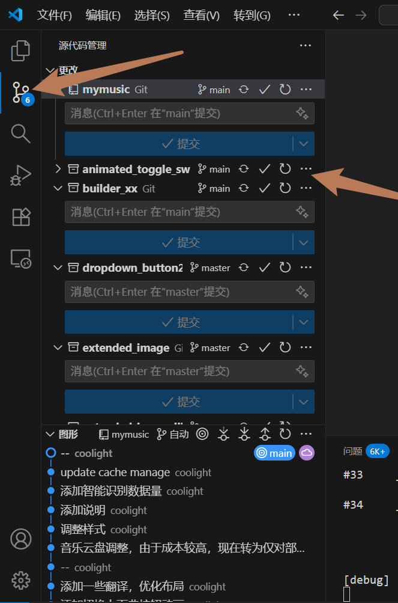
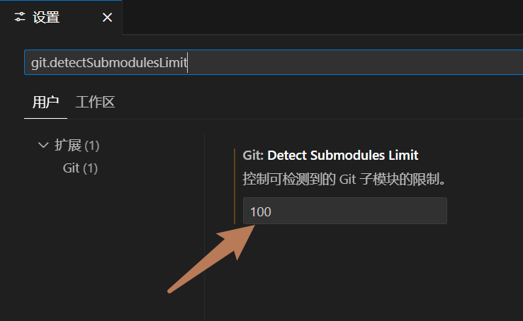

# vscode 部分Git子项目不显示
- vscode自带的Git可视化管理中，发现最近添加的 git submodule 有一些不显示，但 `.gitsubmodule` 文件写的正常的，直接git命令行操作查看也是正常的

## 原因和解决
- 其实启动vscode时就提示了`xxx存储库包含13个子模块，这些子模块不会自动打开。您仍然可以通过打开其中的一个文件来单独打开每个文件。`
- vscode 默认配置只显示10个Git submodule
- 因此解决办法就是打开vscode设置，搜索`git.detectSubmodulesLimit`，改大一点就可以了：
