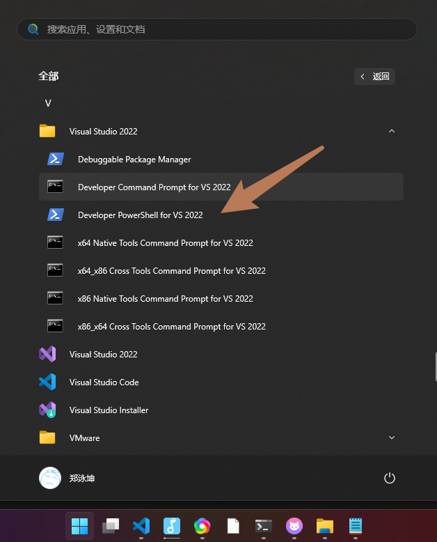

# 前言
- 最近需要在windows上使用ffmpeg的动态库 `libav*` 开发，编译ffmpeg得到了 `include/.h` 和 `.dll` 但是用的时候一直报链接错误，找不到符号：
```sh
正在创建库 build/Debug/mediaxx.lib 和对象 build/Debug/mediaxx.exp
mediaxx.obj : error LNK2019: 无法解析的外部符号 "int __cdecl av_log_get_level(void)" (?av_log_get_level@@YAHXZ)，函数 get_libav_version 中
引用了该符号 [build\mediaxx.vcxproj]
build\Debug\mediaxx.dll : fatal error LNK1120: 1 个无法解析的外部命令 [build\mediaxx.vcxproj]
```
- 查了一下，应该是windows下还需要导入库文件`.lib`，说是编译生成dll的时候会自动生成`.lib`和`.def`符号表文件，不过我没复制出来，懒得再编译就找了个从`.dll`直接生成 `.lib`和`.def` 的方法

## 方法
- 需要已经安装 Visual studio，然后点`任务栏-开始-visual studio/Developer PowerShell`，启动这个pwsh命令行窗口:

- 首先生成`def`文件，也就是一个文本文件：
```sh
dumpbin /exports name_xxx.dll > name_xxx.def
```
- 它的内容一般是这样的：
```txt
Microsoft (R) COFF/PE Dumper Version 14.37.32822.0
Copyright (C) Microsoft Corporation.  All rights reserved.


Dump of file .\avdevice.dll

File Type: DLL

  Section contains the following exports for avdevice-61.dll

    00000000 characteristics
           0 time date stamp
        0.00 version
           1 ordinal base
          15 number of functions
          15 number of names

    ordinal hint RVA      name

          1    0 002B8640 av_device_ffversion
          2    1 001F9C53 av_input_audio_device_next
          3    2 001F9CAD av_input_video_device_next
          4    3 001F9CB7 av_output_audio_device_next
          5    4 001F9D11 av_output_video_device_next
          6    5 001F9D1C avdevice_app_to_dev_control_message
          7    6 001FDBB6 avdevice_configuration
          8    7 001F9D37 avdevice_dev_to_app_control_message
          9    8 001F9E8D avdevice_free_list_devices
         10    9 001FDBBE avdevice_license
         11    A 001F9D4C avdevice_list_devices
         12    B 001F9F3A avdevice_list_input_sources
         13    C 001F9FD7 avdevice_list_output_sinks
         14    D 001F9C40 avdevice_register_all
         15    E 001FDBB0 avdevice_version

  Summary

      101000 .data
        E000 .pdata
       D8000 .rdata
        4000 .reloc
      1FE000 .text
        1000 .tls

```
- 按文本打开，修改刚刚生成的`def`文件内容，只保留中间的符号表，且删除符号前面的东西，然后在开头添加`LIBRARY`和`EXPORTS`，最终变成：
```txt
LIBRARY

EXPORTS
  av_device_ffversion
  av_input_audio_device_next
  av_input_video_device_next
  av_output_audio_device_next
  av_output_video_device_next
  avdevice_app_to_dev_control_message
  avdevice_configuration
  avdevice_dev_to_app_control_message
  avdevice_free_list_devices
  avdevice_license
  avdevice_list_devices
  avdevice_list_input_sources
  avdevice_list_output_sinks
  avdevice_register_all
  avdevice_version

```
- 然后回到命令行，生成lib文件：
```sh
lib /def:name_xxx.def /machine:x64 /out:name_xxx.lib
```
- 基本就ok了，一顿操作后就有了4个文件，其中`dll`是运行时需要用的，其他文件是编译时用的：
```
- avcodec.dll
- avcodec.def
- avcodec.exp
- avcodec.lib
```
- 附带一个`ffmpeg`编译使用的提示：
  - 引用ffmpeg的libav动态库编译后报错找不到符号，可能是因为c++符号签名的问题，include ffmpeg的头文件时应当 extern "C" 包裹：
```c++
// 在c++项目里不能直接 include
#include "third_part/ffmpeg/include/libavutil/log.h"

// 应当用 extern "C"
extern "C" {
#include "third_part/ffmpeg/include/libavutil/log.h"
}
```