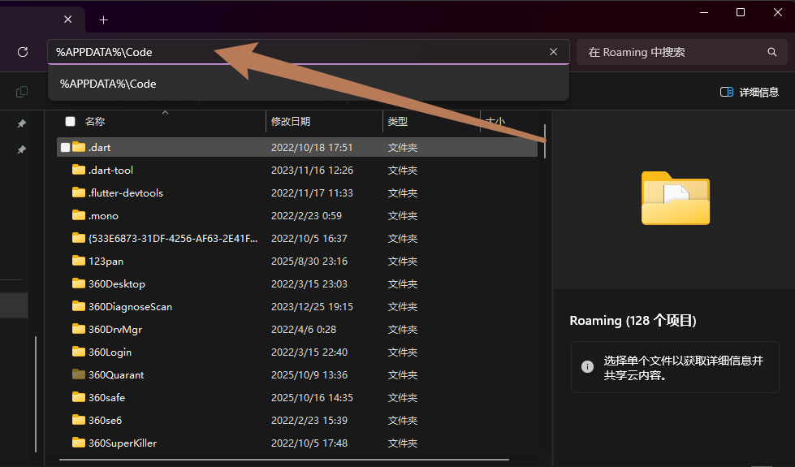

# 前言
- 最近需要在 windows/vscode 上搞c++，但是发现敲c++没有语法提示，也没法跳转函数和变量，想配置c++还弹窗报错：
```sh
command 'C_Cpp.ConfigurationEditUI' not found
command 'C_Cpp.ConfigurationEditJSON' not found
```
- 搜了一下，更新了最新的vscode，但没用，最终还是彻底卸载，重新安装vscode好使
- vscode(官方卸载文档)[https://code.visualstudio.com/docs/setup/uninstall]
- win端卸载程序后还需要手动删除两个文件夹：
  - Windows - Delete `%APPDATA%\Code` and `%USERPROFILE%\.vscode`.
  - macOS - Delete `$HOME/Library/Application Support/Code` and `~/.vscode`.
  - Linux - Delete `$HOME/.config/Code` and `~/.vscode`
- 直接文件管理器点地址栏，然后输入 %APPDATA%\Code ，回车即可跳转：
